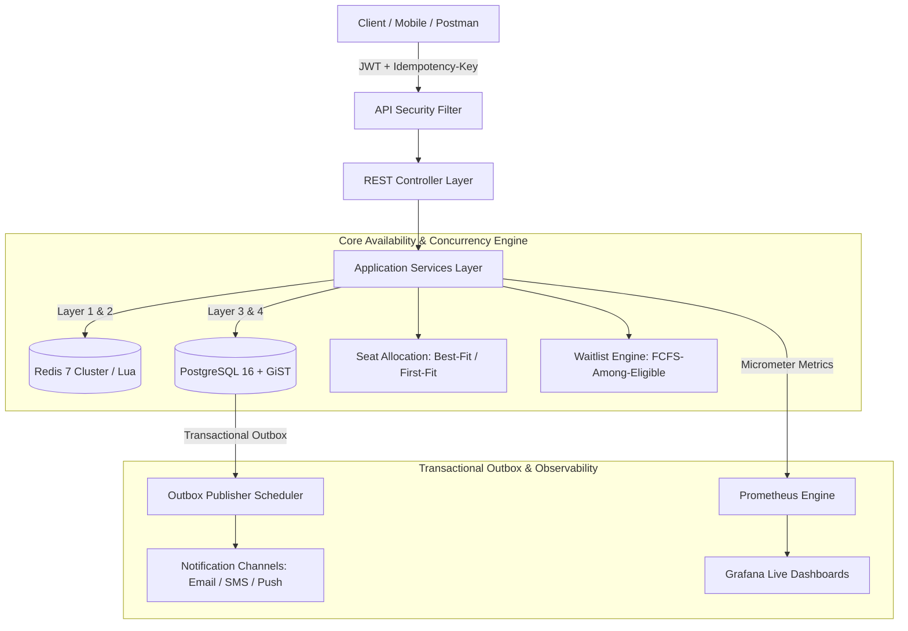

# 🚌 Office Shuttle: Segment-Based Seat Booking Engine
### *High-Throughput, Concurrency-Safe Seat Weaving & Availability Platform*

<div align="center">

[](https://openjdk.org/)
[](https://spring.io/projects/spring-boot)
[](https://www.postgresql.org/)
[](https://redis.io/)
[](https://prometheus.io/)
[](https://grafana.com/)
[](https://www.docker.com/)
[](https://junit.org/junit5/)

</div>

---

> **"One seat, many journeys — made correct by the database, made fast by bitwise arithmetic."**

---

## 📌 Conceptual Overview: The Seat Weaving Paradigm

Traditional bus ticketing treats a seat as a single binary resource: **occupied** or **free** for the entire route. On multi-stop routes ($A \rightarrow B \rightarrow C \rightarrow D$), this causes massive seat under-utilization.

An office shuttle can legally allocate the **exact same physical seat** to Alice for journey $A \rightarrow B$ and to Bob for journey $B \rightarrow D$, because their road segments are completely disjoint.

```
Route Topology:  [Stop 0: A] ── Leg 0 ── [Stop 1: B] ── Leg 1 ── [Stop 2: C] ── Leg 2 ── [Stop 3: D]

Alice (A -> B):  [■■ Occupied ■■]        [   Free   ]        [   Free   ]  --> (Seat 1, Leg 0)
Bob   (B -> D):  [    Free     ]        [■■ Occupied ■■■■■■■■■■■■■■■■■■]  --> (Seat 1, Legs 1 & 2)

Result on Seat 1: [■■ Alice: A->B ■■]    [■■■■■■■■■■■■■■ Bob: B->D ■■■■■■■■■■■■■■]  ==> 100% Capacity!
```

Seat availability is therefore not a boolean check — it is a **half-open interval overlap problem** $[X_s, X_d)$ executed in **$O(1)$ bitwise machine arithmetic**.

---

## 🛡️ The Four-Layer Concurrency Defense Stack

To guarantee **zero double-bookings** under high concurrent load without performance bottlenecks, the system uses defense-in-depth across 4 independent layers:

```
                  [ Incoming Request: Book B -> D ]
                                  │
                                  ▼
 ┌─────────────────────────────────────────────────────────────────┐
 │ 🟢 LAYER 1: In-Memory / Redis Bitmap Filter                     │
 │ • Column-wise transpose bitsets (`freeSeatsOnLeg[i]`)           │
 │ • Sub-microsecond qualifying candidate seat filtering           │
 └────────────────────────────────┬────────────────────────────────┘
                                  ▼
 ┌─────────────────────────────────────────────────────────────────┐
 │ 🟡 LAYER 2: Atomic Redis Lua Script                             │
 │ • Indivisible `BITOP AND` + `BITPOS` + `SETBIT` on cache tier   │
 │ • Closes the race condition window before hitting the database  │
 └────────────────────────────────┬────────────────────────────────┘
                                  ▼
 ┌─────────────────────────────────────────────────────────────────┐
 │ 🟠 LAYER 3: PostgreSQL Row Locking & Authoritative Recheck      │
 │ • `SELECT ... FOR UPDATE SKIP LOCKED` inside ACID transaction   │
 │ • Re-verifies interval overlap against confirmed database rows  │
 └────────────────────────────────┬────────────────────────────────┘
                                  ▼
 ┌─────────────────────────────────────────────────────────────────┐
 │ 🔴 LAYER 4: PostgreSQL GiST Exclusion Constraint                │
 │ • `EXCLUDE USING gist (seat_id WITH =, int4range(...) WITH &&)` │
 │ • Physically rejects conflicting inserts at the storage engine  │
 └─────────────────────────────────────────────────────────────────┘
```

---

## ⚡ Bitwise Availability Math ($O(1)$ Operations)

A shuttle route with $M$ stops contains $M - 1$ legs. Every seat's occupancy mask is stored in a 64-bit integer word:

$$\text{rangeMask}(X_s, X_d) = ((1 \ll (X_d - X_s)) - 1) \ll X_s$$

| Operation | Bitwise Formula | Complexity | Description |
|---|---|---|---|
| **Check Free** | `(seatMask & rangeMask(Xs, Xd)) == 0` | $O(1)$ | Bitwise AND determines conflict instantly |
| **Reserve** | `seatMask |= rangeMask(Xs, Xd)` | $O(1)$ | Bitwise OR marks legs occupied |
| **Release** | `seatMask &= ~rangeMask(Xs, Xd)` | $O(1)$ | Bitwise NOT + AND frees legs |
| **Transpose Reduction** | $\bigcap_{i=X_s}^{X_d-1} \text{freeSeatsOnLeg}[i]$ | $O(1)$ | AND-reduction across legs finds all candidate seats |

<details>
<summary><b>🔍 View Java Bitwise Implementation</b></summary>

```java
public class SeatMap {
    public static long rangeMask(int Xs, int Xd) {
        return ((1L << (Xd - Xs)) - 1) << Xs; // e.g. [1, 3) -> legs 1, 2 -> 0110
    }

    public boolean isSeatFree(int seatNo, Segment segment) {
        return (seatMasks[seatNo - 1] & segment.getRangeMask()) == 0L;
    }

    public BitSet getQualifyingSeats(Segment segment) {
        BitSet result = (BitSet) freeSeatsOnLeg[segment.getFromIdx()].clone();
        for (int i = segment.getFromIdx() + 1; i < segment.getToIdx(); i++) {
            result.and(freeSeatsOnLeg[i]); // Column-wise AND reduction
        }
        return result;
    }
}
```
</details>

---

## 🏗️ System Architecture



---

## 🚀 Quick Start (One Command)

### Run with Docker Compose
```bash
docker compose up --build
```

### Direct Service Endpoints:
| Service | URL | Default Credentials |
|---|---|---|
| **Spring Boot REST API** | `http://localhost:8080` | — |
| **Grafana Dashboard** | `http://localhost:3000` | `admin` / `admin` |
| **Prometheus Metrics** | `http://localhost:9090` | — |
| **PostgreSQL Database** | `localhost:5432` | `shuttle_user` / `shuttle_pass_2026` |
| **Redis Cache** | `localhost:6379` | — |

---

## 🧪 Comprehensive Test Suite (17 Tests)

Run the full automated test suite locally:
```bash
mvn clean test
```

### Verified Test Categories:
```
[INFO] -------------------------------------------------------
[INFO]  T E S T S
[INFO] -------------------------------------------------------
[INFO] Running com.officeshuttle.booking.concurrency.ConcurrentBookingTest     --> 20 threads racing for 1 seat (1 wins, 19 waitlist)
[INFO] Running com.officeshuttle.booking.concurrency.HighValueInvariantTest    --> Zero interval overlaps across all seats
[INFO] Running com.officeshuttle.booking.edgecases.IntervalTrimmingTest        --> Releasing [0,1) from [0,3) for downstream rebooking
[INFO] Running com.officeshuttle.booking.edgecases.NoShowTest                  --> Downstream reclamation without reselling elapsed legs
[INFO] Running com.officeshuttle.booking.edgecases.BusReassignmentTest         --> Breakdown downsizing re-accommodation
[INFO] Running com.officeshuttle.booking.engine.SegmentTest                    --> Half-open interval boundary arithmetic
[INFO] Running com.officeshuttle.booking.engine.SeatMapTest                    --> O(1) bitwise seat weaving & transpose search
[INFO] Running com.officeshuttle.booking.engine.SeatAllocationStrategyTest     --> Best-Fit packing vs First-Fit fragmentation
[INFO] Running com.officeshuttle.booking.engine.PromotionPolicyTest            --> FCFS sweep auto-promoting multiple disjoint requests
[INFO] 
[INFO] Results: Tests run: 17, Failures: 0, Errors: 0, Skipped: 0
[INFO] BUILD SUCCESS
```

---

## 🏢 Fleet Management & Real-World Edge Cases

| Edge Case | Problem | Engineered Solution |
|---|---|---|
| **Passenger No-Show** | Passenger doesn't board at origin. | After grace period, booking transitions to `NO_SHOW`. Downstream legs ($[departedStop, toStop)$) are released for waitlist promotion; elapsed legs are never resold. |
| **Interval Trimming** | Passenger changes boarding stop mid-route. | `PATCH /bookings/{id}/trim` updates interval (e.g. $[0,3) \rightarrow [1,3)$), releasing $[0,1)$ immediately for waitlist promotion. |
| **Vehicle Breakdown** | Replacement bus has fewer seats. | `PATCH /trips/{id}/reassign-bus` keeps earliest-booked passengers seated and moves excess passengers to priority waitlist. |
| **Duplicate Requests** | Mobile client retry / double-tap. | `Idempotency-Key` header enforced; duplicate submissions return the original booking without double-charging or duplicate seats. |
| **Wrong Stop Boarding** | Passenger boards at incorrect stop. | QR Check-in strictly verifies `currentStopIdx == booking.fromStopIdx`. |

---

## 📊 Design Trade-Offs Matrix

| Decision | Chosen Solution | Alternative Considered | Engineering Rationale |
|---|---|---|---|
| **Availability Structure** | **Per-leg Bitmaps** | Segment Tree | $O(1)$ CPU bitwise ops with tiny fixed memory for routes $\le 64$ stops. Segment tree is kept as documented scaling path. |
| **Hot-Path Store** | **Redis + PostgreSQL** | PostgreSQL-only | Sub-millisecond candidate pre-filtering and atomic Lua scripting; self-healed via startup rebuild from Postgres. |
| **Seat Allocation** | **Best-Fit Strategy** | First-Fit | Maximizes bus capacity by packing partially committed seats; prevents fragmenting empty seats. |
| **Waitlist Policy** | **FCFS-Among-Eligible** | Combinatorial-only | Fair and deterministic ordering while still promoting multiple disjoint requests on single cancellation. |
| **Architecture** | **Modular Monolith** | Microservices from Day 1 | Preserves transactional boundaries for booking, cancellation, and promotion without distributed saga overhead. |

---

## 📂 Project Structure

```
office-shuttle-booking/
├── src/main/java/com/officeshuttle/booking/
│   ├── controller/   # REST Controllers (Route, Trip, Booking, Waitlist, Boarding, Auth)
│   ├── service/      # Application Services & Sagas (Booking, Waitlist, Boarding, Notification)
│   ├── engine/       # Core Bitwise Engine (SeatMap, Segment, BestFitStrategy, LuaExecutor, SegmentTree)
│   ├── domain/       # JPA Entities (Route, Stop, Trip, Bus, Seat, Booking, WaitlistEntry, User)
│   ├── repository/   # Repositories with row locks (SKIP LOCKED) & range queries
│   ├── exception/    # DomainException hierarchy + RFC 7807 GlobalExceptionHandler
│   └── config/       # Security, JWT, Redis, Micrometer Metrics & Outbox Scheduler
├── src/test/java/    # Unit, multi-threaded concurrency, invariant & edge-case test suite
├── db/migration/     # Flyway SQL migrations with PostgreSQL GiST exclusion constraint
├── prometheus/       # Prometheus scrape configuration
├── grafana/          # Provisioned Grafana datasources & dashboard definitions
├── postman/          # Complete Postman API collection
├── docs/             # CASE_STUDY.md, ARCHITECTURE.md, ER_DIAGRAM.md, DEMO_GUIDE.md
└── docker-compose.yml
```

---

## 📚 Documentation Deep Dives
- 📄 **[Complete System Design Case Study](docs/CASE_STUDY.md)**: Full 24-section architecture whitepaper.
- 📐 **[System Architecture & Data Flow](docs/ARCHITECTURE.md)**: Deep dive on the modular monolith and caching tiers.
- 🗄️ **[Entity Relationship & GiST Schema](docs/ER_DIAGRAM.md)**: Relational schema and exclusion constraint mechanics.
- 🛡️ **[Mathematical Concurrency Proof](docs/CONCURRENCY_PROOF.md)**: Formal analysis of the 4-layer defense stack.
- 🧪 **[System Verification & Demo Guide](docs/DEMO_GUIDE.md)**: Step-by-step cURL verification commands and outputs.
