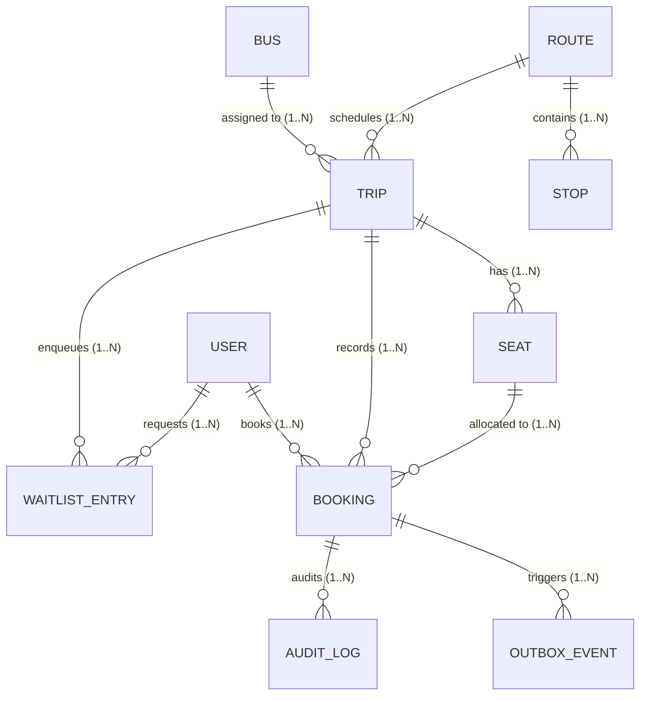

# Office Shuttle: Segment-Based Seat Booking
## Complete System Design Case Study & Engineering Architecture

> *"One seat, many journeys — made correct by the database, made fast by bitwise arithmetic."*

---

## Table of Contents
1. [Executive Summary](#1-executive-summary)
2. [Problem Understanding](#2-problem-understanding)
3. [Requirements Specification](#3-requirements-specification)
4. [System Architecture](#4-system-architecture)
5. [Data Model & ER Diagram](#5-data-model--er-diagram)
6. [Core Engine — Segment Availability & Overlap Detection](#6-core-engine--segment-availability--overlap-detection)
7. [Seat Allocation Strategy — Bitmap Search + Best-Fit](#7-seat-allocation-strategy--bitmap-search--best-fit)
8. [Concurrency — Multi-Layer Defense Against the Last-Seat Race](#8-concurrency--multi-layer-defense-against-the-last-seat-race)
9. [Waitlist, Cancellation & Smart Promotion](#9-waitlist-cancellation--smart-promotion)
10. [Object-Oriented Design](#10-object-oriented-design)
11. [API Design](#11-api-design)
12. [Authentication & Authorization](#12-authentication--authorization)
13. [Caching Strategy](#13-caching-strategy)
14. [Error & Exception Handling](#14-error--exception-handling)
15. [Monitoring & Observability](#15-monitoring--observability)
16. [Fault Tolerance & Failure Recovery](#16-fault-tolerance--failure-recovery)
17. [Real-World Edge Cases](#17-real-world-edge-cases)
18. [Design Trade-offs](#18-design-trade-offs)
19. [Complexity & Cost Analysis](#19-complexity--cost-analysis)
20. [Testing Strategy](#20-testing-strategy)
21. [Technology Stack & Justification](#21-technology-stack--justification)
22. [Project Structure](#22-project-structure)
23. [System Demonstration Storyboard](#23-system-demonstration-storyboard)
24. [Closing Engineering Position](#24-closing-engineering-position)

---

## 1. Executive Summary

A bus-ticketing system that treats a seat as a single binary flag — booked or free for the whole trip — wastes capacity the moment the vehicle serves more than two stops. An office shuttle running $A \rightarrow B \rightarrow C \rightarrow D$ can legally sell seat #5 to one passenger for $A \rightarrow B$ and to a completely different passenger for $B \rightarrow D$, because the two journeys never share a road segment. 

This document designs the backend for exactly that system: every booking is modelled as a **half-open stop interval**, seat availability is an **interval-overlap query** rather than a boolean, and the entire design is built around making that query fast, provably correct under concurrency, and fair when demand exceeds supply.

The central idea is **defense in depth around one shared representation**. Every booking, at every layer, is described in the exact same terms — a contiguous run of route legs — so the same overlap rule is enforced four times, each at a different speed and a different level of trust:
1. A **bitmap-based availability engine** answers *"which seats fit?"* in effectively $O(1)$ time;
2. An **atomic Redis Lua script** makes the check-and-reserve step indivisible on the hot path;
3. A **PostgreSQL transaction with row-level locking** re-validates before committing;
4. A **database exclusion constraint** makes double-booking physically impossible to persist, even if every layer above it has a bug.

Around that core, the system specifies: a PostgreSQL data model as the durable source of truth; a segment- and utilization-aware waitlist with a documented, swappable promotion policy; JWT authentication with role-based access; a cleanly layered, pattern-driven object-oriented codebase; a REST API with idempotency built in; an RFC 7807-style error contract; Prometheus/Grafana observability; and an explicit, tested failure recovery strategy.

---

## 2. Problem Understanding

A shuttle route is a fixed, ordered sequence of stops. Each service day, that route runs as a Trip with a fixed seat count. A passenger doesn't book "a seat" — they book a journey, e.g. $B \rightarrow D$. Because two journeys that share no physical road can safely share a seat, "is a seat free?" cannot be a boolean; it is an interval-overlap test, and it must hold under concurrent load while staying fair to a waitlist.

**Restated core problem**: Given a trip with $N$ seats over $M$ ordered stops, support high-throughput, concurrency-safe `book(segment)`, `cancel(bookingId)`, and `isAvailable(segment)`, where two bookings on one seat are legal iff their stop-ranges are disjoint — touching at a stop is not an overlap — while keeping a fair, promotable waitlist per segment.

### 2.1 Why This Is Harder Than a Normal Bus Ticket

| Naive Assumption | Why It Breaks |
|---|---|
| *"39 of 40 seats sold" is a valid capacity signal* | A trip can show 40/40 sold while several seats sit physically empty on parts of the route — a route-wide counter cannot express per-segment availability. |
| *Touching stops count as an overlap* | $A \rightarrow B$ and $B \rightarrow D$ share zero road segments; treating the shared stop as a conflict is the single most common correctness bug in this problem. |
| *"Check, then write" is safe if the check is fast* | Two requests for the last valid seat on overlapping legs can both pass the check before either writes — the race is closed only by making check-and-write one indivisible operation. |
| *Waitlist promotion means "give the freed seat to the front of the queue"* | The front of the queue may want a segment that does not fit the freed range; promotion has to search for the earliest eligible request, not just the earliest request. |

---

## 3. Requirements Specification

### 3.1 Functional Requirements
- **FR-1**: Admin/Operator can create a Route with ordered Stops and scheduled arrival times.
- **FR-2**: Admin can schedule a Trip for a Route on a date with a fixed seat capacity and bus assignment.
- **FR-3**: Employee can query seat availability for a requested segment on a Trip.
- **FR-4**: Employee can book a segment; the system allocates a qualifying seat automatically (or by preference).
- **FR-5**: Employee can cancel a booking; the freed sub-range becomes bookable immediately.
- **FR-6**: If no seat qualifies, the employee joins a per-trip waitlist in fair (FCFS-eligible) order.
- **FR-7**: On cancellation, the system evaluates and promotes eligible waitlisted passengers automatically.
- **FR-8**: System records check-in/boarding and no-show status per passenger per trip.
- **FR-9**: Admin can move a Trip to a different bus (capacity permitting) without breaking existing bookings.
- **FR-10**: Users authenticate before booking; RBAC separates Employee, Driver, Operator and Admin actions.
- **FR-11**: A passenger can change their boarding stop on an existing booking (interval trimming) before departure.

### 3.2 Non-Functional Requirements
- **NFR-1 (Correctness)**: No double-booking of overlapping segments on the same seat, ever, even under a bug in application code.
- **NFR-2 (Low Latency)**: Availability checks and booking confirmation targeted under $\sim 50\text{ ms}$ p99 end-to-end, $<5\text{ ms}$ at data-structure level.
- **NFR-3 (Space Efficiency)**: Seat-map memory footprint does not grow with booking history.
- **NFR-4 (Fault Tolerance)**: A crashed instance, cache outage, or broker outage must not corrupt or lose booking state.
- **NFR-5 (Observability)**: Every booking decision (accepted / rejected / waitlisted / promoted) is traceable end to end.
- **NFR-6 (Extensibility)**: New allocation heuristics, promotion policies, and notification channels plug in without modifying core logic.

---

## 4. System Architecture

### 4.1 Modular Monolith
Booking, cancellation, and waitlist promotion commit inside one transactional boundary. The system is designed as a modular monolith: one deployable service with hard internal module boundaries behind clean interfaces.

```
 Client / Driver App (Web · Mobile · Postman)
                  │
                  ▼
         API Gateway / Security Filter
         (AuthN · Rate-Limit · Routing)
                  │
                  ▼
          Controller Layer
 (Route/Trip/Booking/Waitlist + Idempotency filter)
                  │
                  ▼
         Application Services
 (BookingService · WaitlistService · BoardingService)
                  │
                  ▼
      Segment Availability Engine
 (Bitmap → Redis Lua → Postgres lock → GiST constraint)
         │                         │
         ▼                         ▼
    PostgreSQL                 Redis Cluster
 (Durable Source of Truth)  (Seat bitmaps · Waitlist ZSETs)
         │
         ▼
 Transactional Outbox → Async Events (Notifications, Analytics, Audit)
```

### 4.2 Why Redis Sits Beside PostgreSQL
PostgreSQL remains the durable source of truth — every confirmed booking commits there, protected by row locks and an exclusion constraint. Redis holds a derived, rebuildable projection purely for speed and atomic scripting. A cached "seat looks free" answer narrows candidates that the authoritative transaction re-checks. If Redis is lost, it is reconstructed from PostgreSQL on startup; if PostgreSQL stalls, the outbox pattern prevents side-effect loss.

---

## 5. Data Model & ER Diagram



### 5.1 Key Schema Decisions
1. **Stop Ordinal Index**: Stops carry a `stop_order` (0-based ordinal position) rather than relying on timestamps for overlap math.
2. **Half-Open Intervals**: Bookings store `from_stop_idx` and `to_stop_idx` as $[from, to)$, making segment arithmetic pure integer-range arithmetic and making "touching at a stop" naturally non-overlapping.
3. **Idempotency Key**: Unique constraint on `idempotency_key` guarantees safe request replays without duplicate bookings.
4. **GiST Exclusion Constraint**:
   ```sql
   ALTER TABLE bookings ADD CONSTRAINT no_overlapping_segments
   EXCLUDE USING gist (
       seat_id WITH =,
       int4range(from_stop_idx, to_stop_idx, '[)') WITH &&
   ) WHERE (status = 'CONFIRMED');
   ```
5. **Optimistic Locking**: `version` column supports optimistic concurrency control on seat modifications.

---

## 6. Core Engine — Segment Availability & Overlap Detection

### 6.1 The Overlap Rule, Stated Precisely
Represent stops as integer positions along the route: $A=0, B=1, C=2, D=3$. A booking from stop $X_s$ to stop $X_d$ occupies the half-open interval $[X_s, X_d)$. Two bookings $[X_s, X_d)$ and $[Y_s, Y_d)$ on the same seat are compatible if and only if:
$$Y_d \le X_s \quad \text{OR} \quad Y_s \ge X_d \quad (\text{conflict iff } X_s < Y_d \text{ AND } Y_s < X_d)$$

Because the interval is half-open, $A \rightarrow B = [0, 1)$ and $B \rightarrow D = [1, 3)$ share no integer point — they are compatible by construction.

### 6.2 The Bitmap Model
A route with $M$ stops has $M - 1$ legs. An interval $[X_s, X_d)$ occupies legs $X_s \dots X_d - 1$. Each seat's occupancy fits in a 64-bit machine word:

```java
long rangeMask(int Xs, int Xd) { return ((1L << (Xd - Xs)) - 1) << Xs; }
boolean isFreeOnSeat(long seatMask, int Xs, int Xd) { return (seatMask & rangeMask(Xs, Xd)) == 0; }
long bookOnSeat(long seatMask, int Xs, int Xd) { return seatMask | rangeMask(Xs, Xd); }
long releaseOnSeat(long seatMask, int Xs, int Xd) { return seatMask & ~rangeMask(Xs, Xd); }
```

### 6.3 Column-Wise Bitsets (Transpose Search)
The engine maintains a transpose array `BitSet[] freeSeatsOnLeg` where bit $s$ is 1 if seat $s$ is free on leg $i$:
```java
BitSet seatsFreeForSegment(BitSet[] freeSeatsOnLeg, int Xs, int Xd) {
    BitSet result = (BitSet) freeSeatsOnLeg[Xs].clone();
    for (int i = Xs + 1; i < Xd; i++) result.and(freeSeatsOnLeg[i]);
    return result; // Set bits = every valid seat
}
```
Runs in $O((X_d - X_s) \times \text{seats} / 64)$ — a handful of CPU AND instructions.

---

## 7. Seat Allocation Strategy — Bitmap Search + Best-Fit

| Strategy | Rule | Trade-off |
|---|---|---|
| **First-Fit** | Pick lowest-numbered qualifying seat. | Trivial and deterministic, but tends to fragment the bus. |
| **Best-Fit (Default)** | Pick seat whose remaining free capacity after booking is smallest. Ties broken by lowest seat number. | Significant utilization gain over first-fit; still $O(1)$-ish since it only scans qualifying candidates. |

```java
int chooseSeat(BitSet candidates, SeatMap seatMap, Segment segment) {
    int bestSeat = -1;
    int bestRemainingFreeLegs = Integer.MAX_VALUE;
    for (int s = candidates.nextSetBit(0); s >= 0; s = candidates.nextSetBit(s + 1)) {
        int seatNo = s + 1;
        int remaining = seatMap.getRemainingFreeLegs(seatNo) - segment.getLegCount();
        if (remaining < bestRemainingFreeLegs || (remaining == bestRemainingFreeLegs && (bestSeat == -1 || seatNo < bestSeat))) {
            bestSeat = seatNo;
            bestRemainingFreeLegs = remaining;
        }
    }
    return bestSeat;
}
```

---

## 8. Concurrency — Multi-Layer Defense Against the Last-Seat Race

### Layer 1: In-Memory / Redis Bitmap Search
Candidate pre-filtering in microseconds.

### Layer 2: Atomic Redis Lua Script
Check-and-reserve executed as an indivisible atomic operation:
```lua
redis.call('BITOP', 'AND', tmpKey, unpack(KEYS))
local seatBit = redis.call('BITPOS', tmpKey, 1)
if seatBit == -1 or seatBit >= tonumber(ARGV[1]) then return -1 end
for i = 1, #KEYS do redis.call('SETBIT', KEYS[i], seatBit, 0) end
return seatBit + 1
```

### Layer 3: PostgreSQL Row Locking & Recheck
```sql
SELECT * FROM seats WHERE trip_id = :tripId ORDER BY seat_no FOR UPDATE SKIP LOCKED;
SELECT 1 FROM bookings WHERE seat_id = :seatId AND status = 'CONFIRMED'
AND from_stop_idx < :requestedTo AND to_stop_idx > :requestedFrom LIMIT 1;
```

### Layer 4: PostgreSQL GiST Exclusion Constraint
The physical storage engine guarantee that aborts any overlapping insert regardless of application state.

---

## 9. Waitlist, Cancellation & Smart Promotion

### 9.1 Fair Ordering
Each trip maintains a monotonically increasing `sequence_no` mirrored across PostgreSQL and Redis Sorted Sets.

### 9.2 Smart Promotion Algorithm
1. Cancel the booking inside a transaction; release legs in Redis and PostgreSQL.
2. Fetch all `WAITING` entries for the trip ordered by `sequence_no` ascending.
3. For each entry, evaluate `seatsFreeForSegment`. If any seat qualifies, promote that entry (`PROMOTED`), allocate seat, and continue scanning (a single cancellation can free capacity for multiple disjoint waitlisted segments).
4. Stop when no remaining waiting entry can be satisfied.

### 9.3 Combinatorial Promotion Policy (Extension)
If no single waitlisted request fills a freed long segment (e.g. $A \rightarrow D$), the combinatorial engine searches for a pair of compatible waitlisted requests that together cover it without overlapping (e.g. $A \rightarrow B$ plus $B \rightarrow D$).

---

## 10. Object-Oriented Design

- **Encapsulation**: `SeatMap` is the single boundary allowed to manipulate raw bitmasks.
- **Polymorphism**: Pluggable `SeatAllocationStrategy` (`BestFit`, `FirstFit`) and `PromotionPolicy` (`FcfsEligible`, `Combinatorial`).
- **Observer Pattern**: `NotificationChannel` (`Email`, `SMS`, `Push`) decoupled from `BookingService`.
- **Factory Pattern**: `TripService` schedules trips, seat rows, and Redis bitmap keys atomically.
- **State Pattern**: Explicit booking state machine (`CONFIRMED`, `CHECKED_IN`, `NO_SHOW`, `CANCELLED`).

---

## 11. API Design

| Method & Path | Purpose | Role |
|---|---|---|
| `POST /api/v1/auth/login` | Authenticate user & issue JWT | Public |
| `POST /api/v1/routes` | Create route with ordered stops | `ADMIN` |
| `POST /api/v1/trips` | Schedule trip for route + bus + date | `ADMIN` |
| `GET /api/v1/trips/{id}/availability` | Query qualifying seats for segment | `EMPLOYEE` |
| `POST /api/v1/trips/{id}/bookings` | Book a segment (`Idempotency-Key` mandatory) | `EMPLOYEE` |
| `POST /api/v1/bookings/{id}/cancel` | Cancel booking & trigger promotion sweep | `EMPLOYEE` |
| `PATCH /api/v1/bookings/{id}/trim` | Change boarding stop (interval trimming) | `EMPLOYEE` |
| `POST /api/v1/trips/{id}/waitlist` | Explicitly join waitlist for segment | `EMPLOYEE` |
| `POST /api/v1/bookings/{id}/check-in` | Driver QR check-in at stop | `DRIVER` |
| `PATCH /api/v1/trips/{id}/reassign-bus` | Reassign trip bus / re-accommodate | `OPERATOR` |

---

## 12. Authentication & Authorization

- Stateless JWT access tokens (15-min expiry) with HMAC-SHA256 signature.
- Central RBAC enforced via Spring Security filter chain (`EMPLOYEE`, `DRIVER`, `OPERATOR`, `ADMIN`).
- Passwords hashed with BCrypt.
- Mandatory `Idempotency-Key` header on booking mutations tied to authenticated `userId`.

---

## 13. Caching Strategy

- **Tier 1 (Hot Path)**: Seat bitmaps and Waitlist ZSETs live in Redis as the active working store.
- **Tier 2 (Semi-Static)**: Route topology and user profiles cached with TTL and explicit invalidation.
- **Eviction Policy**: `allkeys-lru` on Tier-2 keys only; Tier-1 bitmap keys are never evicted.

---

## 14. Error & Exception Handling

Standardized on **RFC 7807 Problem Details** format:
```json
{
  "type": "https://api.shuttle/errors/segment-unavailable",
  "title": "Segment Unavailable",
  "status": 409,
  "detail": "No seat is free for the entire requested segment.",
  "traceId": "7f8b9e12-3456-4abc-9def-123456789abc",
  "instance": "/api/v1/trips/1/bookings",
  "waitlistOffer": {
    "action": "POST /api/v1/trips/1/waitlist"
  }
}
```

---

## 15. Monitoring & Observability

### Technical Metrics (Prometheus)
- `booking_requests_total{result="CONFIRMED|WAITLISTED|REJECTED"}`
- `booking_latency_seconds` (p50, p95, p99 percentiles)
- `booking_race_conflicts_total` (Layer 2/3/4 conflict interceptions)
- `outbox_backlog_size` (Pending async event gauge)

### Business Metrics
- `seat_utilization_ratio{trip}` (Booked legs $\div$ Total legs across all seats)
- `promotion_success_total` (Auto-promoted waitlist passengers)

---

## 16. Fault Tolerance & Failure Recovery

| Failure Scenario | Mitigation & Self-Healing |
|---|---|
| **Redis node crash** | AOF persistence; on restart, `RedisBitmapRebuildService` reconstructs bitmaps from PostgreSQL `CONFIRMED` rows. |
| **PostgreSQL primary failure** | Transaction aborts cleanly; compensating action releases provisional Redis reservation. |
| **Partial saga failure** | Compensating transaction releases bit immediately; periodic reconciliation diffs Redis bitmaps against DB and self-heals. |
| **Broker / notification outage** | Transactional Outbox pattern: bookings and events commit atomically; background publisher retries independently. |
| **Complete cache outage** | System degrades gracefully to DB-only path (`SELECT ... FOR UPDATE SKIP LOCKED`). |

---

## 17. Real-World Edge Cases

1. **No-Show Downstream Seat Reclamation**: Transitions un-boarded booking to `NO_SHOW` after grace period; releases only downstream legs ($[departedStop, toStop)$) for promotion without reselling elapsed legs.
2. **Mid-Route Boarding Change (Interval Trimming)**: `PATCH /bookings/{id}/trim` updates interval (e.g. $[0, 3) \rightarrow [1, 3)$), releasing $[0, 1)$ immediately for downstream booking.
3. **Vehicle Breakdown Re-accommodation**: `PATCH /trips/{id}/reassign-bus` keeps earliest-booked passengers seated and automatically moves excess passengers to a priority waitlist.
4. **Duplicate Request Retries**: Handled via unique `Idempotency-Key` returning original booking result without side effects.
5. **Wrong Stop Boarding**: Check-in validates that current stop matches booking `fromStopIdx`.

---

## 18. Design Trade-offs

| Decision | Chosen Solution | Alternative | Rationale |
|---|---|---|---|
| **Availability Structure** | Per-leg Bitmap | Segment Tree | $O(1)$ bitwise operations, tiny fixed memory for routes $\le 64$ stops. Segment tree is documented scaling fallback. |
| **Correctness Defense** | 4-Layer Defense Stack | Single-layer trust | Negligible overhead for absolute mathematical correctness. |
| **Hot-Path Store** | Redis alongside PostgreSQL | PostgreSQL-only | Sub-millisecond latency and atomic Lua scripting primitive; self-healed via startup rebuild and periodic reconciliation. |
| **Seat Selection** | Best-Fit Allocation | First-Fit | Better bus utilization and less fragmentation. |
| **Waitlist Policy** | FCFS-Among-Eligible | Combinatorial only | Simple, fair, and explainable while still packing multi-segment freed capacity. |
| **Service Topology** | Modular Monolith | Microservices from Day 1 | Keeps booking/cancel/promote inside one transactional boundary. |

---

## 19. Complexity & Cost Analysis

| Operation | Naive Scan | This Design | Space Complexity |
|---|---|---|---|
| Check seat free for segment | $O(k)$ ($k$ = bookings on seat) | $O(M/64) \approx O(1)$ bitmap | $O(M)$ bits per seat |
| Find all qualifying seats | $O(N \cdot k)$ | $O((X_d - X_s) \cdot N/64) \approx O(1)$ | $O(N \cdot M)$ bits per trip |
| Book / cancel segment | $O(k)$ insert/remove | $O(1)$ bit flips $+ O(\log K)$ indexed DB check | Fixed space (no growth over time) |
| Promotion sweep after cancel | $O(W \cdot N \cdot k)$ | $O(W \cdot (X_d - X_s) \cdot N/64)$ | $W$ = waitlist size |
| DB overlap re-validation | — | $O(\log K)$ via B-tree index on `(seat_id, from, to)` | $K$ = active bookings per seat |

---

## 20. Testing Strategy

- **Domain Unit Tests**: `SegmentTest`, `SeatMapTest`, `SeatAllocationStrategyTest`, `PromotionPolicyTest`.
- **Multi-Threaded Concurrency Test**: `ConcurrentBookingTest` (20 concurrent threads competing for 1 physical seat; verifies exactly 1 succeeds and 19 fail/waitlist).
- **Mathematical Invariant Test**: `HighValueInvariantTest` (iterates all confirmed bookings per seat and asserts zero interval overlaps).
- **Edge Case Tests**: `IntervalTrimmingTest`, `NoShowTest`, `BusReassignmentTest`.

---

## 21. Technology Stack & Justification

- **Language / Framework**: Java 17/21 + Spring Boot 3.2.5
- **Durable Store**: PostgreSQL 16 + Flyway + GiST (`btree_gist` extension)
- **Hot-Path Cache**: Redis 7 (AOF enabled, atomic Lua scripts)
- **Security**: Spring Security + JWT (JJWT 0.12.5) + BCrypt
- **Observability**: Micrometer + Prometheus + Grafana Dashboards
- **Containerization**: Docker & Docker Compose

---

## 22. Project Structure

```
office-shuttle-booking/
├── src/main/java/com/officeshuttle/booking/
│   ├── controller/ (Route, Trip, Booking, Waitlist, Boarding, Auth)
│   ├── service/    (BookingService, WaitlistService, BoardingService, RouteService, TripService, AuthService)
│   ├── engine/     (SeatMap, Segment, SeatAllocationStrategy, BestFitStrategy, FcfsEligiblePolicy, RedisScriptExecutor, SegmentTree)
│   ├── domain/     (Route, Stop, Trip, Bus, Seat, Booking, WaitlistEntry, User, OutboxEvent, AuditLog)
│   ├── repository/ (JPA repositories with row-level locks & range queries)
│   ├── exception/  (DomainException hierarchy + RFC 7807 GlobalExceptionHandler)
│   └── config/     (SecurityConfig, JwtService, RedisConfig, MetricsConfig, OutboxPublisherScheduler)
├── src/test/java/... (unit, concurrency, invariant & edge-case test suite)
├── src/main/resources/
│   ├── db/migration/ (V1__init_schema.sql, V2__seed_data.sql)
│   └── scripts/      (book_segment.lua, release_segment.lua)
├── docker-compose.yml
├── prometheus/prometheus.yml
├── grafana/provisioning/...
├── postman/office_shuttle_api.postman_collection.json
├── docs/ (ARCHITECTURE.md, ER_DIAGRAM.md, CONCURRENCY_PROOF.md, DEMO_GUIDE.md)
└── README.md
```

---

## 23. System Demonstration Storyboard

1. **Setup**: Route $A \rightarrow B \rightarrow C \rightarrow D$, Trip scheduled with 3 seats.
2. **Happy Path / Seat Reuse**: Alice books $A \rightarrow B$ on Seat 1; Bob books $B \rightarrow D$ on Seat 1.
3. **Boundary / Overlap Conflict**: User requests $A \rightarrow C$ when seats are booked $\rightarrow$ clean 409 + waitlist offer.
4. **Concurrency Race**: 20 parallel threads compete for 1 seat $\rightarrow$ exactly 1 confirmed, 19 waitlisted; `booking_race_conflicts_total` increments.
5. **Database-Level Proof**: Direct raw SQL insert violating overlap constraint is rejected by PostgreSQL GiST exclusion index.
6. **Cancellation & Auto-Promotion**: Alice cancels $A \rightarrow B \rightarrow$ waitlisted passenger auto-promoted to Seat 1.
7. **Fault Injection & Recovery**: Redis container stopped $\rightarrow$ degrades to DB-only path; on restart, bitmaps auto-reconstructed from PostgreSQL.

---

## 24. Closing Engineering Position

This design refuses to model a shuttle seat as simply "occupied" or "free." The real resource is **seat $\times$ route interval**, and once that model is explicit, the rest of the architecture follows:
- Integer leg indices and half-open ranges for correctness;
- A bitmap engine for $O(1)$ speed;
- An atomic Redis script, a PostgreSQL transaction, and a database exclusion constraint stacked as independent layers of defense;
- A best-fit allocator and an eligibility-aware FIFO waitlist for fairness and utilization;
- Observability, caching, and failure recovery built in from the start.

### Three Invariants
- **Ordering**: Every booking satisfies $fromIdx < toIdx$.
- **Physical Capacity**: No seat ever holds two overlapping active intervals — enforced four times, independently.
- **Atomicity**: The availability check and booking commit are never separated by a window another writer can exploit.
