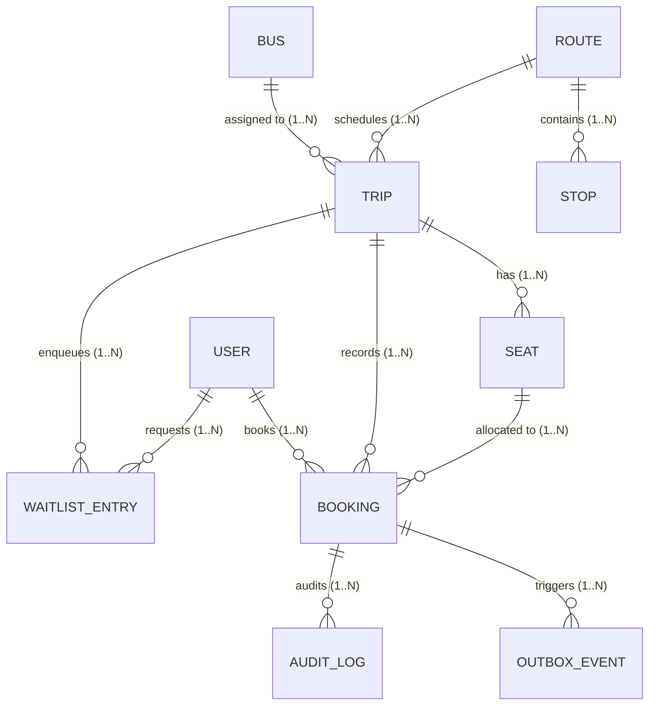

# Entity Relationship & Database Schema

## 1. Relational Topology



## 2. Key Database Schema Details

### PostgreSQL GiST Exclusion Constraint
```sql
ALTER TABLE bookings ADD CONSTRAINT no_overlapping_segments
EXCLUDE USING gist (
    seat_id WITH =,
    int4range(from_stop_idx, to_stop_idx, '[)') WITH &&
)
WHERE (status = 'CONFIRMED');
```

- `int4range(from, to, '[)')` represents a half-open interval.
- `WITH &&` tests for range overlap.
- `WITH =` ensures collision checks are partitioned by physical `seat_id`.
- `WHERE (status = 'CONFIRMED')` allows cancelled/no-show records to remain in history without blocking re-booking.
